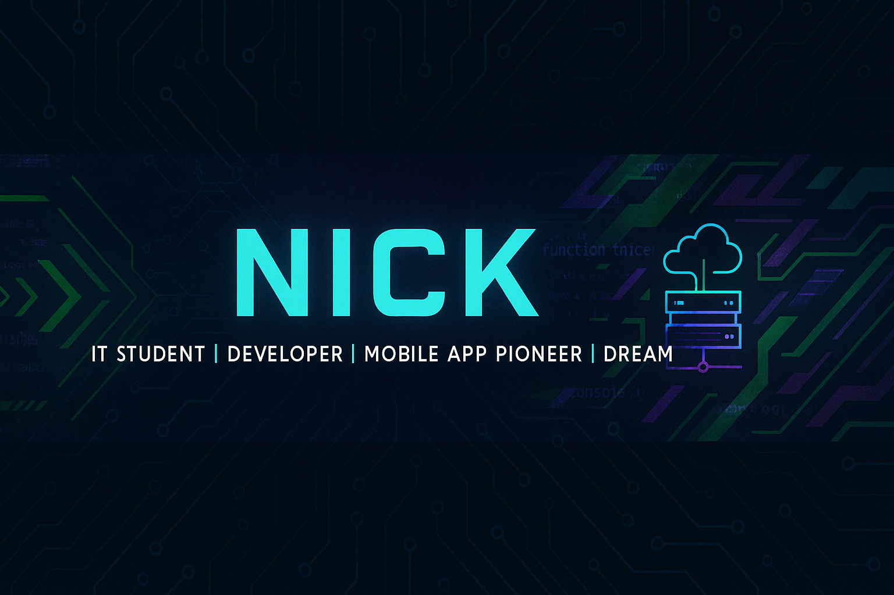

# 👋🏾 Hey, I'm Nick

🎓 IT student @ KCA University  
💻 Java | 🌐 Spring Boot | 📱 Android Dev (Java + XML)  
🧠 Always pushing beyond the syllabus  

---

## 🛠️ Tech Stack
- ⚙️ Java, Spring Boot, MySQL  
- 💻 Java Practicals (Data Structures, OOP, Algorithms)  
- 🖥️ HTML, CSS, JS (Web Basics)  
- 🤖 Mobile App Dev (Java + XML)  
- 🌍 Git, GitHub, REST APIs  

---

## 🚀 Featured Projects

  
Frontend for **Resourcify**, a smart emergency resource allocation system.  

  
Spring Boot + MySQL backend powering Resourcify APIs.  

  
A **mobile-first smart campus app** with AI insights & offline mode (in progress).  

  
Android app UI for an electronic product catalog.  

  
A car and car parts sales website – one of my first coding projects.  

  
A collection of **Java programming practicals** – covering fundamentals, OOP, data structures, algorithms, and problem-solving.  

---

## 🌱 Currently Learning
- 🧰 Full-stack backend API development  
- 📲 Mobile-to-Cloud integration (Android ↔ Spring Boot)  
- 🧬 DS & Algos in Java  

---

## 📈 GitHub Stats

  
   

  

---

## ❤️ Sponsor My Work

If you find my work helpful, consider supporting me!  

  
  

---

## 📬 Let's Connect
- ✉️ Email: [nicolaskariuki7@gmail.com](mailto:nicolaskariuki7@gmail.com)  
- 📱 Phone: [+254-718-501-864](+254-718-501-864)  
- 📍 Kenya | 🌍 Citizen of the Web  
- 🧠 Mantra: *“My peace is top priority, but my potential is even greater.”*  
