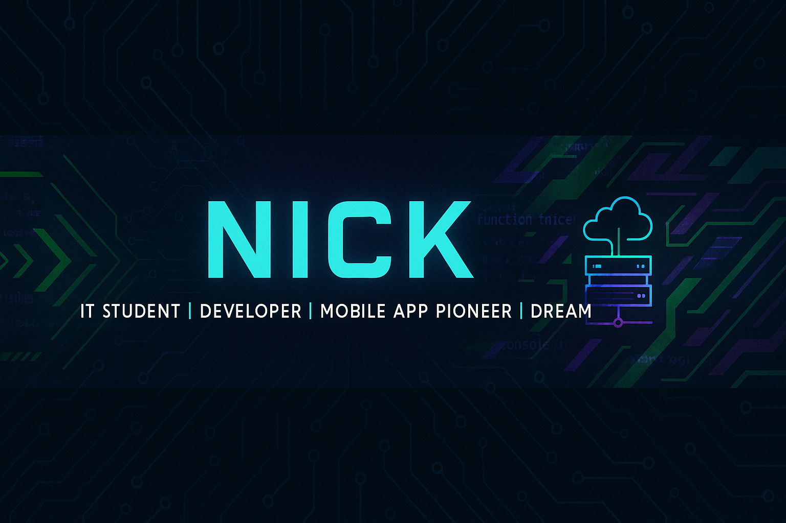

👋🏾 Hey, I'm Nick (Nicholas Kariuki Wambui)

🎓 IT Student @ KCA University | 💻 Full-Stack Java Developer | ICT Support @Thika Technical Training Institute 
🧠 “My peace is top priority, but my potential is even greater.”

👨‍💻 About Me

I am a passionate Full-Stack Developer focused on building digital solutions that bridge the gap between traditional processes and modern efficiency. I specialize in Spring Boot backends and Native Android development.

🛠️ Tech Stack & Skills

 

 

 

 

 

Frameworks: Spring Security, Hibernate, JPA

Mobile: Android SDK (Java/XML), Retrofit 2, Jetpack

Methodology: Agile/Scrum, Iterative Development

🚀 Featured Projects

🔗 AttachLink

Digital Internship Management System for KCA University

The Problem: Replaces manual, physical logbooks with a real-time digital workflow.

The Tech: Spring Boot (JWT), Android (Java), MySQL, Firebase (FCM).

Status:

🚑 Resourcify

Smart Emergency Resource Allocation System

Integrated Frontend and Backend ecosystem for emergency response optimization.

📊 GitHub Statistics

📬 Let's Connect

✉️ Email: nicolaskariuki7@gmail.com

📍 Location: Kenya | 🌍 Citizen of the Web

📱 Phone: +254-718-501-864

“Coding the future, one commit at a time.”
